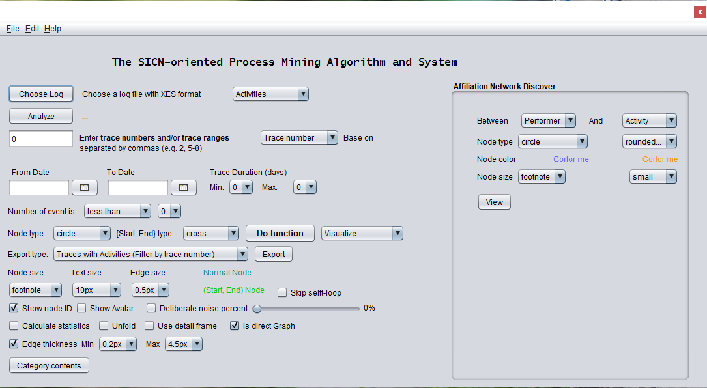

##### **INSTRUCTION FOR RUNNING SICN-ORIENTED PROCESS MINING SYSTEM ON JAVA ENVIRONMENT**

**I. System requirements:**
-	Java JDK 8. Download it from here: https://www.oracle.com/kr/java/technologies/javase/javase-jdk8-downloads.html
(You will need to register an account to download the package)

**II. Setup Java JDK 8 and the environment:**
1. Microsoft Windows OS
- Download and install Java 8 on your computer. Remember the Java installed location. You will need it in the next step.

- Setup the JAVA_HOME invironment by following the instruction in this website: https://javatutorial.net/set-java-home-windows-10
(Remember to put the correct variable value.  The path looks like “c:\Program Files\Java\jdk1.8.0_261” in the previous step).
- Open Command Prompt in the Windows OS,  run this command: javac –version.  This will print out the version of the java compiler in your computer. You can only run the tool whenever you can run this command successfully.

2. Mac OS
- Download and install Java 8 on your computer. Remember the Java installed location. You will need it in the next step.
- Setup the JAVA_HOME invironment by following the instruction in this website: http://www.sajeconsultants.com/how-to-set-java_home-on-mac-os-x/?utm_source=rss&utm_medium=rss&utm_campaign=how-to-set-java_home-on-mac-os-x
- Open the Terminal on MAC,  run this command: java -version.  This will print out the version of the java compiler in your computer. You can only run the tool whenever you can run this command successfully.

**III. Run the system:**
Run the java jar file: SICN-OrientedPMAS.jar

**IV. Data set:**
See the logs folder 

or download:
- Large bank transaction: https://data.4tu.nl/articles/dataset/Large_Bank_Transaction_Process/12714395
- Review example large: https://data.4tu.nl/articles/dataset/Synthetic_event_logs_-_review_example_large_xes_gz/12716609

