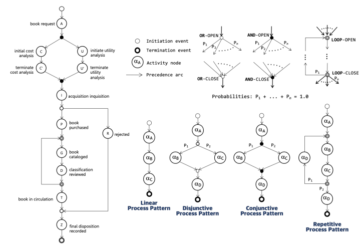
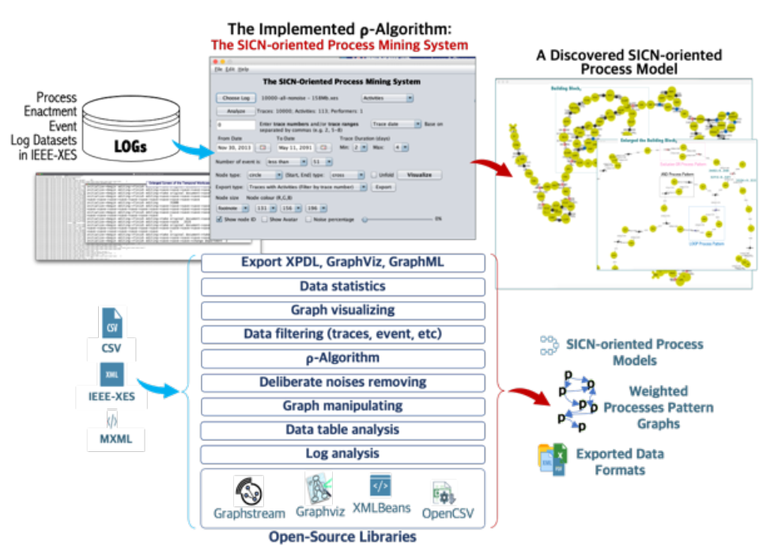
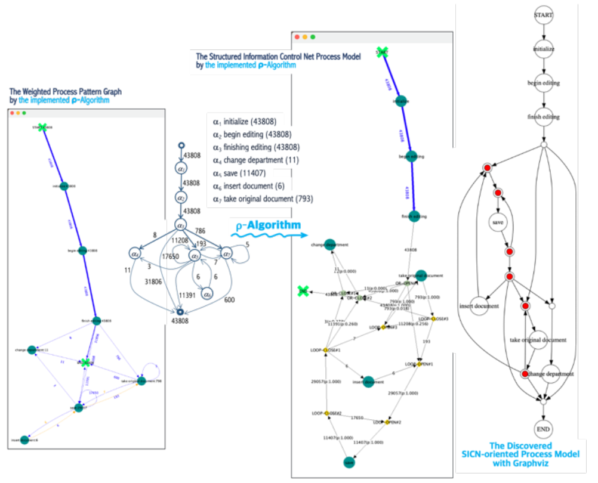
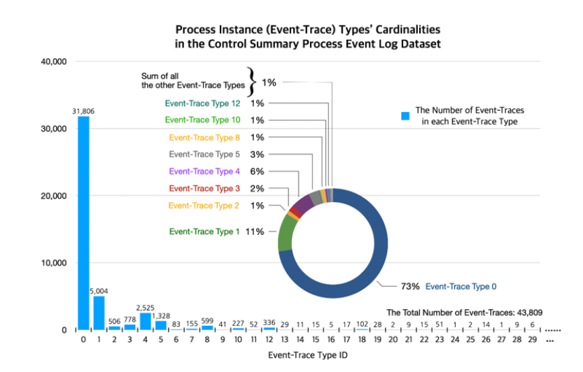
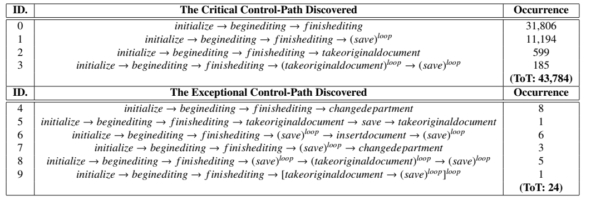

# The SICN-oriented Process Mining Algorithm and System

This repository contains the System described in the paper entitled "Experimental Verification and Validation of the SICN-oriented Process Mining Algorithm and System"

**Paper summary**

**Abstract**:
The purpose of this paper is to verify the functional correctness of a specific process mining algorithm and to validate the requirement satisfaction of the targeted algorithm, as well. The functional requirement of the process mining algorithm is to discover all the structural process patterns, such as linear (sequential), disjunctive (selective-OR), conjunctive (parallel-AND), and repetitive (iterative-LOOP) process patterns, from a dataset of process enactment event logs, and to eventually build a structured business process model by assembling all the discovered structural process patterns. The targeted algorithm to be verified and validated in this paper is called as p-Algorithm that is especially devised for discovering a structured information control net process model (SICN-oriented process model) from a dataset especially prepared in the standardized IEEE XES event stream format. In order to carry out the verification and validation, we have successfully developed a process mining system based upon the p-Algorithm, and through which four rounds of experiments are taken with four real datasets that are well fitted into the following situational mining and discovering scenarios: Faultlessness Process, Matched-Pairing Violation but Sound Process, Matched-Pairing and Proper-Nesting Violation but Sound Process, and Nebulous Process (Adaptive Cases). Conclusively, we strongly believe that the p-Algorithm is theoretically safe as well as functionally operable, and that the implemented p-Algorithm is also practically applicable to a process mining system as one of the business process and workflow intelligence solutions.

**Experimental results**

A SICN-oriented Process Model and Four Transition Types of Structural Process Patterns

The Implemented ρ-Algorithm: Functional Framework of the SICN-oriented Process Mining System

The V&V Experiment-2 (Matched-Pairing Violation but Sound): the Control Summary SICN-oriented Process Model Discovered by the Implemented ρ-Algorithm

The Event-Trace Distribution Analysis of the Control Summary Process Dataset

The Discovered Control-Path Analysis of the Control Summary Process Dataset

**Conclusion**

Conclusively, through these four scenarios of the V&V experiments we were able to evidently confirmed that the p-Algorithm and its implemented system works perfectly for those process event log datasets recorded from all the different classes of business process models spanning not only the traditional business process models like productional and transactional process models but also the advanced and modern business process models supporting the knowledge-based and intelligence-based workers and performers like collaborative process models and adaptational process models.
As the future research of the paper, we need to carry out another rounds of the V\&V experiments for the next generation SICN-oriented process mining algorithm and system that is an extended version not only to discover all the complicated combination and compound fashion of the structured information control net process models, but also to properly deal with any types of noises embedded in the process event log datasets.

